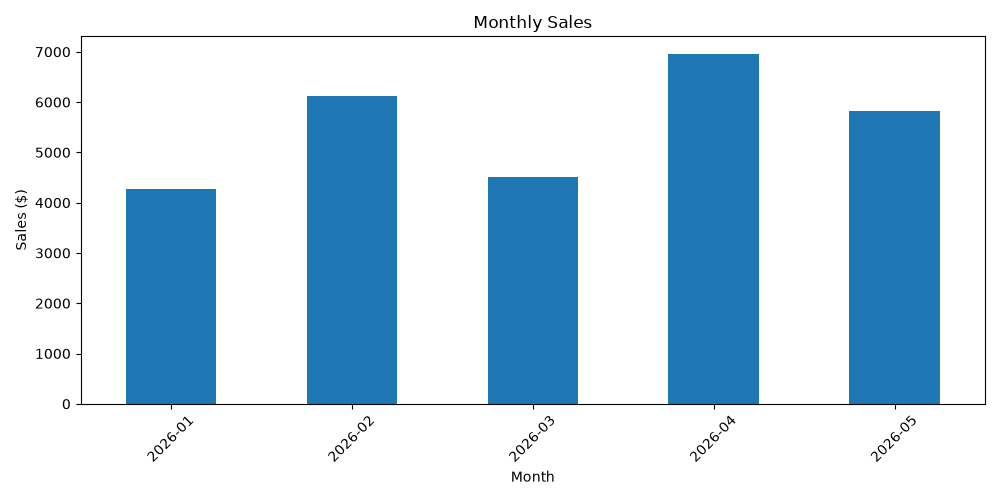
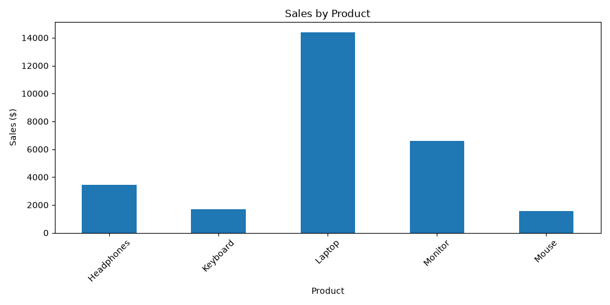
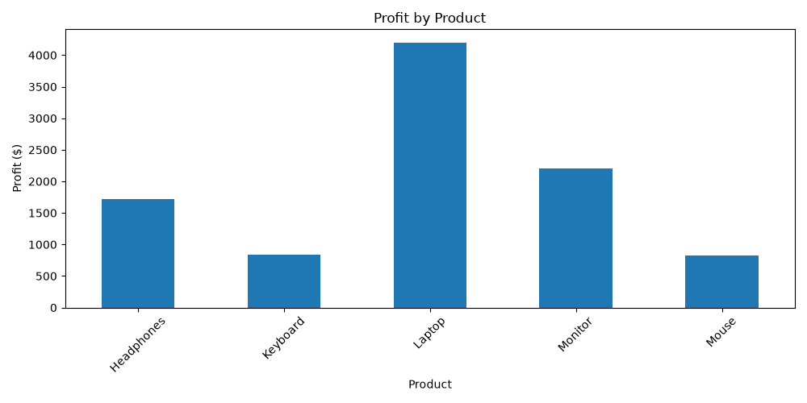

# Sales Data Analyzer 📊

A Python-based sales data analysis project built with Pandas and Matplotlib.

This project analyzes sales data from a CSV file and provides insights into sales performance, profit, products, categories, and monthly sales trends.

## 🚀 Features

- Read sales data from a CSV file
- Calculate total sales
- Calculate total profit
- Calculate profit margin
- Find the best-selling product
- Find the highest-revenue category
- Analyze monthly sales
- Analyze revenue by product
- Analyze profit by product
- Generate data visualizations with Matplotlib

## 🛠️ Technologies

- Python 3.13
- Pandas
- Matplotlib
- CSV

## 📁 Project Structure

```text
SalesDataAnalyzer/
│
├── charts/
│   ├── monthly_sales.png
│   ├── product_sales.png
│   └── product_profit.png
│
├── data/
│   └── sales.csv
│
├── main.py
├── requirements.txt
└── README.md

## 📈 Visualizations

### Monthly Sales

The project analyzes sales performance across different months and generates a monthly sales chart.



### Sales by Product

The project compares total revenue generated by each product.



### Profit by Product

The project compares the total profit generated by each product.

